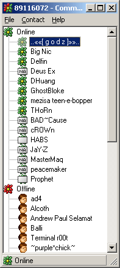



## Communicator \- an ICQ Client made in VB, with many functions\.

### Description

Communicator is an ICQ client made in VB using the ICQ ActiveX Control. It features include Send/Recv Messages (Text, URL, Contact) and search/add user to contact list, Get user info, update your info and more.

Please rate / comment on the code so that we can see where we need to improve.

Also visit www.medievilz.com (Mirror: medievilz.cjb.net) for more information on the client and the ICQ ActiveX Control
 
### More Info
 

             |
---                |---
**Submitted On**   |2000-11-22 22:03:34
**By**             |[James Salim](https://github.com/Planet-Source-Code/PSCIndex/blob/master/ByAuthor/james-salim.md)
**Level**          |Intermediate
**User Rating**    |4.3 (30 globes from 7 users)
**Compatibility**  |VB 6\.0
**Category**       |[Internet/ HTML](https://github.com/Planet-Source-Code/PSCIndex/blob/master/ByCategory/internet-html__1-34.md)
**World**          |[Visual Basic](https://github.com/Planet-Source-Code/PSCIndex/blob/master/ByWorld/visual-basic.md)
**Archive File**   |[CODE\_UPLOAD1191911222000\.zip](https://github.com/Planet-Source-Code/james-salim-communicator-an-icq-client-made-in-vb-with-many-functions__1-12962/archive/master.zip)

